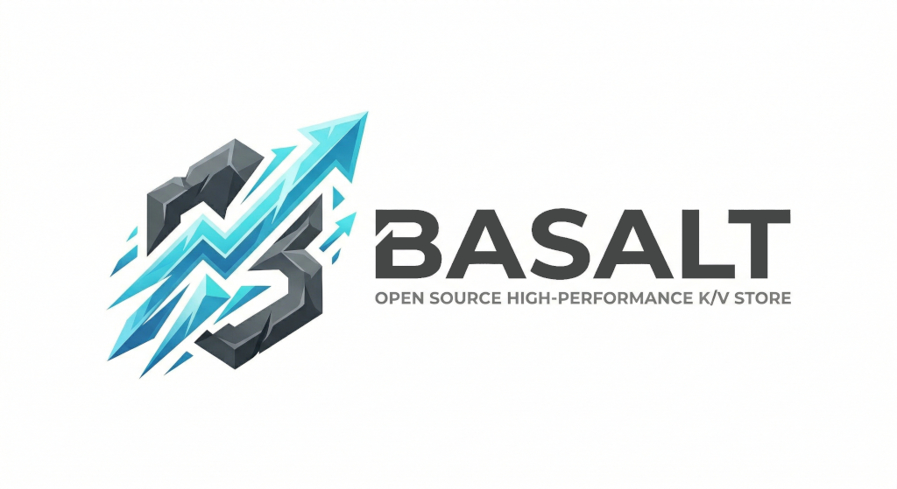

<div align="center">
  
</div>

# Basalt

Ultra-high performance key-value store purpose-built for AI agent memory.

Dual-protocol: **HTTP REST API** (port 7380) for agents + **RESP2** (port 6380) for Redis-compatible tooling and benchmarks.

## Why Basalt?

Redis and Memcached are general-purpose caches. Basalt is laser-focused on one workload: **storing and retrieving memories for AI agents**.

That workload has specific properties we exploit:

| Property | Implication |
|---|---|
| Read-heavy (50-100:1) | Lock-free reads via papaya concurrent HashMap |
| Namespace-partitioned | First-class `/store/{namespace}` paths, native prefix scan |
| TTL-aware by type | Episodic memories auto-expire, semantic/procedural don't |
| Small-to-medium values | No blob overhead, optimized for 16B–8KB values |
| Bulk retrieval | One call to fetch all memories for an agent |

## Performance

Single-threaded criterion benchmarks on the core engine (64 shards, papaya HashMap):

| Operation | Latency | Throughput (est.) |
|---|---|---|
| **GET** (100K keys) | 323 ns | ~3.1M ops/sec |
| **SET** (16B value) | 1.26 µs | ~790K ops/sec |
| **SET** (1KB value) | 2.68 µs | ~370K ops/sec |
| **SET** (8KB value) | 4.11 µs | ~240K ops/sec |
| **Mixed 90/10** (read-heavy) | 584 ns | ~1.7M ops/sec |

RESP2 protocol parser (SIMD-accelerated via memchr):

| Operation | Latency |
|---|---|
| **Parse simple string** | 88 ns |
| **Parse SET command** | 190 ns |
| **Parse 10-command pipeline** | 3.1 µs (310 ns/cmd) |
| **Parse 100-command pipeline** | 29.5 µs (295 ns/cmd) |
| **Serialize bulk string** | 59 ns |

Multi-threaded throughput scales linearly with shards (64 by default) since reads are lock-free.

Run your own: `cargo bench`

## Quick Start

```bash
# Build and run
cargo run --release

# HTTP API (port 7380)
curl http://localhost:7380/health
# → {"status":"ok"}

# Store an episodic memory (auto-expires in 1 hour)
curl -X POST http://localhost:7380/store/agent-42 \
  -H 'Content-Type: application/json' \
  -d '{"key":"obs:1","value":"saw a red car","type":"episodic","ttl_ms":3600000}'
# → {"key":"obs:1","value":"","type":"episodic","ttl_ms":3600000}

# Retrieve it
curl http://localhost:7380/store/agent-42/obs:1
# → {"key":"obs:1","value":"saw a red car","type":"episodic","ttl_ms":3599420}

# List all memories for an agent
curl http://localhost:7380/store/agent-42

# Filter by type
curl 'http://localhost:7380/store/agent-42?type=episodic'

# Store a semantic memory (permanent — no TTL)
curl -X POST http://localhost:7380/store/agent-42 \
  -H 'Content-Type: application/json' \
  -d '{"key":"fact:earth","value":"earth is round","type":"semantic"}'

# Delete a memory
curl -X DELETE http://localhost:7380/store/agent-42/obs:1

# Nuke an entire namespace
curl -X DELETE http://localhost:7380/store/agent-42

# RESP (Redis-compatible) on port 6380
redis-cli -p 6380 PING
# → PONG
redis-cli -p 6380 SET mykey myvalue
# → OK
redis-cli -p 6380 GET mykey
# → "myvalue"
```

## Configuration

Basalt can be configured via CLI flags, a TOML config file, or both (CLI overrides config file).

### CLI flags

```bash
basalt --http-port 8080 --resp-port 6379 --shards 128
basalt --auth "bsk-admin:*" --auth "bsk-agent1:agent-1,shared"
basalt --auth-file /etc/basalt/tokens.txt
```

### Config file

```bash
basalt --config /etc/basalt/basalt.toml
```

```toml
# basalt.toml
[server]
http_host = "127.0.0.1"
http_port = 7380
resp_host = "127.0.0.1"
resp_port = 6380
shard_count = 64

[auth]
tokens_file = "/etc/basalt/tokens.txt"
```

CLI flags override config file values. See `basalt.example.toml` for a full example.

### Auth tokens file

One token per line, whitespace-delimited: `<token> <namespace1> [namespace2 ...]`

```text
# Admin — full access to all namespaces
bsk-admin-secret *

# Agent 1 — own namespace + shared
bsk-agent1-abc123 agent-1 shared

# Agent 2 — only its namespace
bsk-agent2-def456 agent-2
```

Use `--auth-file /path/to/tokens.txt` on the CLI or set `tokens_file` in the config. See `tokens.example.txt`.

CLI `--auth` flags override file entries with the same token value.

## HTTP API

| Method | Path | Description |
|---|---|---|
| `GET` | `/health` | Health check |
| `GET` | `/info` | Server info (version, shard count) |
| `POST` | `/store/{namespace}` | Store a memory |
| `POST` | `/store/{namespace}/batch` | Store multiple memories |
| `POST` | `/store/{namespace}/batch/get` | Retrieve multiple memories |
| `GET` | `/store/{namespace}` | List all memories in namespace |
| `GET` | `/store/{namespace}/{key}` | Get a specific memory |
| `DELETE` | `/store/{namespace}/{key}` | Delete a memory |
| `DELETE` | `/store/{namespace}` | Delete entire namespace |

### POST /store/{namespace}

```json
{
  "key": "obs:1",
  "value": "saw a red car",
  "type": "episodic",
  "ttl_ms": 3600000
}
```

- `key` (required) — key within the namespace
- `value` (required) — the memory content
- `type` (optional, default: `semantic`) — `episodic`, `semantic`, or `procedural`
- `ttl_ms` (optional) — custom TTL in milliseconds; overrides type default

### POST /store/{namespace}/batch

Store multiple memories in a single request.

```json
{
  "memories": [
    {"key": "obs:1", "value": "saw a red car", "type": "episodic", "ttl_ms": 3600000},
    {"key": "fact:x", "value": "something", "type": "semantic"}
  ]
}
```

Response: `{"ok": true, "stored": 2}`

### POST /store/{namespace}/batch/get

Retrieve multiple memories by key.

```json
{"keys": ["obs:1", "fact:gravity", "nonexistent"]}
```

Response:
```json
{
  "memories": [
    {"key": "obs:1", "value": "saw a red car", "type": "episodic", "ttl_ms": 3599420},
    {"key": "fact:gravity", "value": "earth is round", "type": "semantic"}
  ],
  "missing": ["nonexistent"]
}
```

### GET /store/{namespace}

Query params:
- `type` — filter by memory type (`episodic`, `semantic`, `procedural`)
- `prefix` — filter by key prefix within the namespace

### Response format

```json
{
  "key": "obs:1",
  "value": "saw a red car",
  "type": "episodic",
  "ttl_ms": 3599420
}
```

`ttl_ms` is `null` for semantic and procedural memories (no expiry).

## RESP Commands

Standard Redis-compatible:

| Command | Description |
|---|---|
| `SET key value [EX sec \| PX ms]` | Store a value |
| `GET key` | Retrieve a value |
| `DEL key [key ...]` | Delete keys |
| `MGET key [key ...]` | Multi-get |
| `MSET key value [key value ...]` | Multi-set |
| `KEYS prefix*` | List keys matching prefix |
| `PING` | Health check |
| `INFO` | Server info |

Basalt-specific:

| Command | Description |
|---|---|
| `MSETT key value type [PX ms]` | Set with memory type (`episodic`, `semantic`, `procedural`) |
| `MGETT key` | Get value + type + TTL |
| `MSCAN prefix` | Scan all key-value pairs matching prefix |
| `MTYPE key` | Get the memory type of a key |

## Memory Types

| Type | Description | Default TTL |
|---|---|---|
| **Episodic** | Conversations, observations, events | 1 hour |
| **Semantic** | Facts, rules, learned knowledge | No expiry |
| **Procedural** | Skills, how-to knowledge | No expiry |

Episodic memories auto-expire because old observations become stale. Semantic and procedural memories persist — facts and skills don't go bad.

## Architecture

```
                    ┌─────────────┐
    HTTP ──────────►│   axum      │
  (port 7380)      │   router    │
                    ├─────────────┤
                    │  Command    │────►  Sharded KV Engine
    RESP ──────────►│  Dispatch   │       (64 papaya HashMaps)
  (port 6380)      │             │
                    └─────────────┘
```

- **Sharding**: Keys hashed to shards via fxhash (fast, good distribution)
- **papaya**: Lock-free concurrent SwissTable — reads scale linearly with cores
- **TTL**: Per-entry expiry with lazy eviction (checked on read)
- **Dual protocol**: Same engine, two frontends — no data duplication

## Configuration

```bash
basalt [OPTIONS]

Options:
  --http-host <HOST>     HTTP bind address [default: 127.0.0.1]
  --http-port <PORT>     HTTP port [default: 7380]
  --resp-host <HOST>     RESP bind address [default: 127.0.0.1]
  --resp-port <PORT>     RESP port [default: 6380]
  --shards <N>           Number of shards [default: 64]
```

## 400 Agents? No Problem.

Each agent gets its own namespace (`/store/agent-42/`). The sharded engine distributes keys across 64 independent HashMaps — no global lock, no contention between agents. 400 concurrent HTTP connections is trivial for Tokio's async runtime.

## Authentication

Basalt supports optional bearer token authentication scoped to namespaces. When no tokens are configured, all requests are allowed (auth disabled).

### Starting with auth

```bash
# Wildcard token (admin access to all namespaces)
basalt --auth "bsk-admin:*"

# Scoped tokens (specific namespaces only)
basalt --auth "bsk-admin:*" --auth "bsk-agent1:agent-1,shared" --auth "bsk-agent2:agent-2"
```

### HTTP

All `/store/*` endpoints require `Authorization: Bearer <token>` when auth is enabled. `/health` and `/info` remain unauthenticated.

```bash
# Works — admin has access to everything
curl -H "Authorization: Bearer bsk-admin" http://localhost:7380/store/agent-1/mem:1

# Works — agent1 has access to agent-1 namespace
curl -H "Authorization: Bearer bsk-agent1" -X POST http://localhost:7380/store/agent-1 \
  -d '{"key":"obs:1","value":"saw something","type":"episodic"}'

# 403 — agent1 cannot access agent-2 namespace
curl -H "Authorization: Bearer bsk-agent1" http://localhost:7380/store/agent-2/mem:1

# 401 — no token at all
curl http://localhost:7380/store/agent-1/mem:1
```

### RESP

Redis-compatible `AUTH` command. If auth is enabled, you must authenticate before any other command.

```
AUTH bsk-admin       → +OK
AUTH bsk-wrong       → -ERR invalid token
PING (no auth)       → -NOAUTH Authentication required
```

## Persistence

Basalt supports optional disk persistence via snapshots. When `db_path` is configured, the engine writes binary snapshots to disk and restores them on startup.

### Config

```toml
[server]
db_path = "/var/lib/basalt"          # directory for snapshots
snapshot_interval_ms = 60000          # auto-snapshot every 60s (default), 0 = disabled
```

Or via CLI:
```bash
basalt --db-path /var/lib/basalt --snapshot-interval 30000
```

### Manual snapshots

Trigger a snapshot on demand:

- **HTTP**: `POST /snapshot` → `{"ok":true,"path":"...","entries":42}`
- **RESP**: `SNAP` → `$72\r\nOK snapshot saved: /var/lib/basalt/snapshot-1712951000.bin (42 entries)\r\n`

Returns `412` (HTTP) or `-ERR no db_path configured` (RESP) if persistence is disabled.

### How it works

- **Format**: Custom binary — magic header + version + length-prefixed entries (key, value, memory_type, expires_at)
- **Atomic writes**: Snapshot goes to a `.tmp` file, then renamed to final path (no partial reads)
- **Auto-pruning**: Keeps the last 3 snapshots, removes older ones automatically
- **Startup**: Loads the latest snapshot from `db_path`, skips expired entries
- **Episodic memories**: TTL is preserved in snapshots — expired entries are skipped on load

